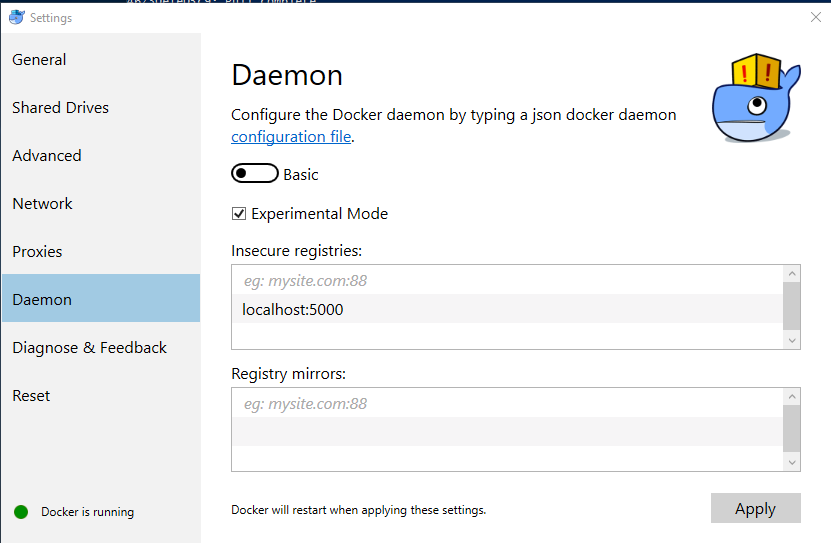

## Lab 10: Operations with images

#### Objectives

You are already familiar with one command, `docker images`. You can also remove images, tag and untag them. Also we learn how to push and pull a image to a local registry.

--------

#### Step 1: Build a new version

First let build the new figlet v3 from Dockerfile, so that we have more versions.
```
 $ docker build -t figlet:v3 .
```

--------

#### Step 2: Removing images and containers

Let's start with removing the image figlet version 1 (figlet:v1) that takes too much disk space:

```
$ docker rmi figlet:v1
Error response from daemon: conflict: unable to remove repository reference "figlet:v1" (must force) - container 3b8931ffdacd is using its referenced image bbc0e5eb5777

```

Docker complains that there are containers using this image. How is this possible? We thought that all our containers are gone.
Actually, Docker keeps track of all containers, even those that have stopped:

```
$ docker ps -a
CONTAINER ID        IMAGE               COMMAND                    CREATED             STATUS                        PORTS                    NAMES
74ed5559950b        figlet              "bash"                     5 hours ago         Exited (127) 5 seconds ago                             stupefied_colden
025bc7941f8d        figlet              "bash"                     5 hours ago         Exited (0) 17 minutes ago                              determined_mestorf
2a4897f417e6        figlet              "/bin/sh -c 'figle..."     5 hours ago         Exited (0) 18 minutes ago                              infallible_euler
```

We can now delete the container:

```
$ docker rm 74ed5559950b
74ed5559950b
```

and the image:

```
$ docker rmi figlet:v1
Untagged: figlet:v1
Deleted: sha256:1deb0689407271616d779920b479c2f1fcacb704f7d2b1a155f30e53cb63754f
Deleted: sha256:78564bb1cdb863ad490ba272d04b5c1bf60bb390bd3a9d9aa6ce5e140d597bc3
Deleted: sha256:ed08aaa4b5b884fd1270c3171709063a941bb0cf2f9e8201fc5166be3e406b1e
```

--------

#### Step 3: Tagging images

`docker tag` helps us to tag images.

We have a lot of versions of `figlet` built, but latest still points to the old `v2`.

```
$ docker images | grep figlet
figlet                                             v2                  bbc0e5eb5777        2 days ago          170 MB
figlet                                             v3                  bbc0e5eb5777        2 days ago          170 MB
figlet                                             latest              b7fa8e20196b        2 days ago          170 MB
```

Let's change that by re-tagging `latest` to `v4`:

```
$ docker tag figlet:v4 figlet:latest
$ docker images | grep figlet
figlet                                             v2                  bbc0e5eb5777        2 days ago          170 MB
figlet                                             v3                  bbc0e5eb5777        2 days ago          170 MB
figlet                                             latest              b7fa8e20196b        2 days ago          170 MB
figlet                                             v4                  b7fa8e20196b        2 days ago          170 MB

```

Both `v4` and `latest` point to the same image ID.

--------

#### Step 4: Publishing images to a local registry

Docker expects all registries to run on HTTPS. But for this lab we will run a version on HTTP. The Docker Engine needs to be explicitly setup to use HTTP for the insecure registry. 

In Docker for Mac, the Preferences menu lets you set the address for an insecure registry under the Daemon panel: 


In Docker for Windows, the Settings menu lets you set the address for an insecure registry under the Daemon panel: 



Images are distributed with a special service - `docker registry`.

Let us spin up a **local** registry:

```
$ docker run -p 5000:5000 --name registry -d registry:2
```

`docker push` is used to publish images to registries.

To instruct where we want to publish, we need to append registry address to repository name:

First tag the figlet images:
```
$ docker tag figlet:v4 127.0.0.1:5000/figlet:v4
```
After that push the images to the local registry:
```
$ docker push 127.0.0.1:5000/figlet:v4
The push refers to a repository [127.0.0.1:5000/figlet]
78171efc0c5e: Pushed
5154177609a7: Pushed
33f1a94ed7fc: Pushed
b27287a6dbce: Pushed
47c2386f248c: Pushed
2be95f0d8a0c: Pushed
2df9b8def18a: Pushed
v4: digest: sha256:dd02511304a21786165baead16b0f140d573a693e925215b99254585d4931898 size: 1779
```
--------

#### Step 5: Remove figlet:v4 image

Enter the following commands to clean up figlet version 4:

```
$ docker rmi 127.0.0.1:5000/figlet:v4
```

See that the figlet images are removed.

```
$ docker images
```

--------

#### Step 6: PULL the image from registry

We can now download the image using the `docker pull` command:

```
$ docker pull 127.0.0.1:5000/figlet:v4
v4: Pulling from figlet
Digest: sha256:c472a7ec8ab2b0db8d0839043b24dbda75ca6fa8816cfb6a58e7aaf3714a1423
Status: Image is up to date for 127.0.0.1:5000/figlet
```

and see that it is back again:

```
$ docker images
```
 


